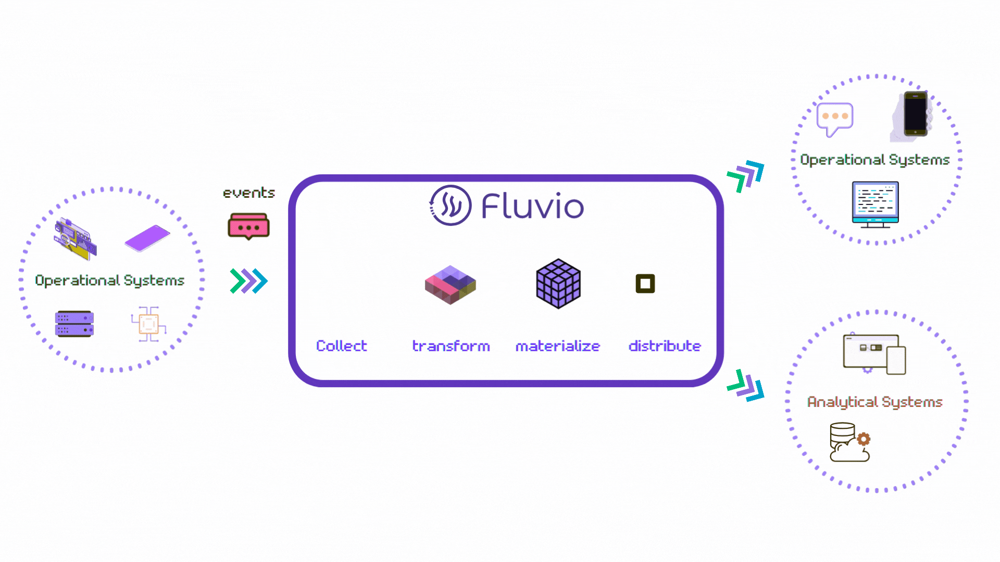

<div align="center">
  <h1>Fluvio</h1>
  <a href="https://fluvio.io" target="_blank">
    <strong>Composable, Declarative, Stateful Data Streaming System</strong>
  </a>
  <br>
  <br>

[](https://github.com/infinyon/fluvio/actions/workflows/ci.yml)
  [](https://github.com/infinyon/fluvio/actions/workflows/cd_dev.yaml)
  [](https://crates.io/crates/fluvio)
  [](https://docs.rs/fluvio)
  [](https://deps.rs/repo/github/infinyon/fluvio)
  [](https://discordapp.com/invite/bBG2dTz)

  <br>

  [](https://fluvio.io)

  <br>
  <br>
</div>

Fluvio is a lightweight high-performance distributed data streaming system written in Rust and Web Assembly.

## Quick Start - Get started with Fluvio in 2 minutes or less!

### Step 1. Download Fluvio Version Manager:

On your terminal run

```bash
curl -fsS https://hub.infinyon.cloud/install/install.sh | bash
```

Follow the instructions and copy/paste the path to the `bin` directory to your startup script file.

Fluvio version manager will give you the ability to download different versions of Fluvio:
- Including our read-only edge cluster with built-in compression, caching, and mirroring to never lose data even with extended downtimes.
- Or our Developer Preview of Stateful Streaming which we are building using the web assembly component model to support all web assembly compatible languages.

### Step 2. Start local cluster:

The following command will start a local cluster by default:

```bash
fluvio cluster start
```

### Step 3. Create Topic:

The following command will create a topic called hello-fluvio:

```bash
fluvio topic create hello-fluvio
```

### Step 4. Produce to Topic, Consume From Topic:

Produce data to your topic. Run the command first and then type some messages:

```bash
fluvio produce hello-fluvio
> hello fluvio
Ok!
> test message
Ok!
```

Consume data from the topic, Run the following command in a different terminal:

```bash
fluvio consume hello-fluvio -B -d
```

Just like that! You have a local cluster running.

## Next Steps
Now that you have a cluster running you can try building data flows in different paradigms.

#### Check Fluvio Core Documentation
Fluvio documentation will provide additional context on how to use the Fluvio clusters, CLI, clients, a development kits.
- [Fluvio docs home](https://www.fluvio.io/docs/)
- [Fluvio CLI docs home](https://www.fluvio.io/cli/)
- [Fluvio Architecture](https://www.fluvio.io/docs/architecture/overview/)

#### Learn how to build custom connectors
Fluvio can connect to practically any system that you can think of.
- For first party systems, fluvio clients can integrate with the edge system or application to source data.
- For third party systems fluvio connectors connect at the protocol level and collects data into fluvio topics.

Out of the box Fluvio has native http, webhook, mqtt, kafka inbound connectors. In terms of outbound connectors out of the box Fluvio supports SQL, DuckDB, Graphite, experimental builds of Redis, S3 etc.

Using Connector Development Kit, we built our existing connectors in a matter of few days. Check out the docs and let us know if you need help building any connector.
- [Connector docs](https://www.fluvio.io/connectors/)
- [Connector Development Kit docs](https://www.fluvio.io/connectors/cdk/overview/)

#### Learn how to build custom smart modules
Fluvio applies wasm based stream processing and data transformations. We call these reusable transformation functions smart modules. Reusable Smart modules are built using Smart Module Development Kit and can be distributed using InfinyOn Cloud hub. 

- [Smart Modules docs](https://www.fluvio.io/smartmodules/)
- [Smart Modules Development Kit docs](https://www.fluvio.io/smartmodules/)

There are some limitations on the amount of polyglot development interface support. While bindings can be generated for wasm compatible languages, there are quirks in that approach. We have a better solution with Stateful Service Development Kit, which we are implementing using the web assembly component model. In the upcoming releases we will be able to natively support all wasm compatible programming languages.

- Stateful Service Development Kit docs- *Coming Soon* [Request Developer Preview Invite](https://infinyon.com/request/ss-early-access/)

#### Try workflows on InfinyOn Cloud
InfinyOn Cloud is Fluvio on the cloud as a managed service. All new users get $3000 worth of credits to build data flows on InfinyOn Cloud.
- [Check InfinyOn Cloud Guides](https://infinyon.com/docs/guides/)
- [Check out experimental data flows on InfinyOn Labs Repo](https://github.com/infinyon/labs-projects)

### Clients
- [Fluvio Client API docs home](https://www.fluvio.io/api/)

**Language Specifc API docs:**
- [Rust API docs](https://docs.rs/fluvio/latest/fluvio/)
- [Python API docs](https://infinyon.github.io/fluvio-client-python/fluvio.html)
- [Javascript API docs](https://infinyon.github.io/fluvio-client-node/)
- [Java API docs](https://infinyon.github.io/fluvio-client-java/com/infinyon/fluvio/package-summary.html)

**Community Maintained:**
- [Go API docs](https://github.com/avinassh/fluvio-go)
- [Java API docs](https://github.com/infinyon/fluvio-client-java)
- [Elixir API docs](https://github.com/viniarck/fluvio-ex)

## Contributing

If you'd like to contribute to the project, please read our
[Contributing guide](CONTRIBUTING.md).

### Contributors are awesome
<a href="https://github.com/infinyon/fluvio/graphs/contributors">
  
</a>

Made with [contrib.rocks](https://contrib.rocks).

## License

This project is licensed under the [Apache license](LICENSE).
