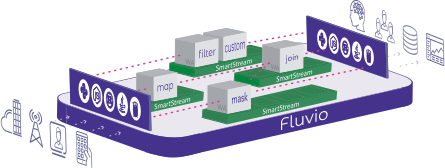

<div align="center">
<h1>Fluvio</h1>

<a href="https://fluvio.io" target="_blank">
<strong>The programmable streaming platform for data in motion</strong>
</a>

<br>
<br>

<div>
<!-- CI status -->
<a href="https://github.com/infinyon/fluvio/actions">

</a>

<!-- Crates.io badge -->
<a href="https://crates.io/crates/fluvio">

</a>

<!-- docs.rs docs -->
<a href="https://docs.rs/fluvio">

</a>

<!-- Discord invitation -->
<a href="https://discordapp.com/invite/bBG2dTz">

</a>
</div>

<a href="https://fluvio.io">

</a>

<br>
<br>
</div>

Fluvio is a distributed, programmable streaming platform written in Rust.

- **High-performance and scalable**: written in Rust leveraging asynchronous code
- **Cloud-Native**: integrated with Kubernetes for declarative, self-healing ops
- **Programmable**: able to deploy WASM modules for arbitrary inline data processing

## Installation

The [Fluvio CLI] is available for MacOS and Linux, and can be installed with the following one-liner:

[Fluvio CLI]: https://fluvio.io/download

```
curl -fsS https://packages.fluvio.io/v1/install.sh | bash
```

The next step is to set up a Fluvio Cluster, which can be done by

- [Creating a free Fluvio Cloud account](https://cloud.fluvio.io), or
- Launching your own cluster on [MacOS] or [Linux]

[MacOS]: https://fluvio.io/docs/getting-started/mac
[Linux]: https://fluvio.io/docs/getting-started/linux

Spoiler: After installing system dependencies, launching a cluster is as easy as

```
fluvio cluster start
```

## Quick start

Once we have Fluvio installed, we can create a new Topic where we'll
be producing and consuming data.

```
$ fluvio topic create hello-fluvio
topic "hello-fluvio" created
```

Open a consumer to stream records that arrive in the Topic:

```
$ fluvio consume hello-fluvio -B
Consuming records from the beginning of topic 'hello-fluvio'
```

As the prompt says, the consumer is now waiting for records to arrive.

Open a new terminal and produce some data using Fluvio's interactive prompt:

```
$ fluvio produce hello-fluvio
> This is my first record
Ok!
> This is my second record
Ok!
> ^C
```

These records will appear in the consumer window as they're sent!

See the [Producer] and [Consumer] documentation for more details on
sending and receiving records with Fluvio.

[Producer]: https://www.fluvio.io/cli/commands/produce/
[Consumer]: https://www.fluvio.io/cli/commands/consume/
