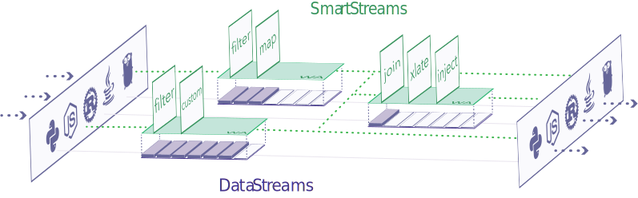

  <h1>Fluvio</h1>
  <a href="https://fluvio.io" target="_blank">
    <strong>The programmable data streaming platform</strong>
  </a>
   
   

  
  
  
  
  
  

   

  

   
   

Fluvio is a high-performance distributed data streaming platform that's written
in Rust, built to make it easy to run real-time applications.

## Quick Links

- [Download](https://www.fluvio.io/download/)
- [Rust API docs](https://docs.rs/fluvio)
- [Node API docs](https://infinyon.github.io/fluvio-client-node/)
- [Fluvio CLI docs](https://www.fluvio.io/cli/)
- [Fluvio Architecture](https://www.fluvio.io/docs/architecture/overview/)

## Contributing

If you'd like to contribute to the project, please read our
[Contributing guide](CONTRIBUTING.md).

## License

This project is licensed under the [Apache license](LICENSE).
